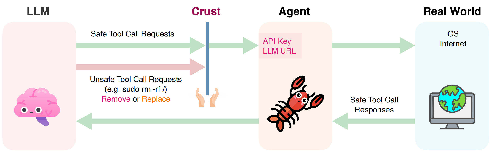

<p align="center">
  
</p>

<h1 align="center">Crust</h1>

<p align="center">
  <strong>Your agents should never <del>(try to)</del> read your secrets.</strong>
</p>

<p align="center">
  <a href="https://getcrust.io">Website</a> •
  <a href="#quick-start">Quick Start</a> •
  <a href="#built-in-protection">Protection</a> •
  <a href="#how-it-works">How It Works</a> •
  <a href="#documentation">Docs</a> •
  <a href="https://github.com/BakeLens/crust/issues">Issues</a> •
  <a href="https://github.com/BakeLens/crust/discussions">Discussions</a>
</p>

<p align="center">
  <a href="https://github.com/BakeLens/crust/actions/workflows/ci.yml"></a>
  <a href="https://goreportcard.com/report/github.com/BakeLens/crust"></a>
  <a href="https://github.com/BakeLens/crust/releases"></a>
  
  
  
</p>

## What is Crust?

Crust is a transparent, local gateway between your AI agents and LLM providers. It intercepts every tool call — file reads, shell commands, network requests — and blocks dangerous actions before they execute. No code changes required.

**100% local. Your data never leaves your machine.**

<p align="center">
  
</p>

## Quick Start

**macOS / Linux:**
```bash
/bin/bash -c "$(curl -fsSL https://raw.githubusercontent.com/BakeLens/crust/main/install.sh)"
```

**Windows (PowerShell):**
```powershell
irm https://raw.githubusercontent.com/BakeLens/crust/main/install.ps1 | iex
```

**Docker:**
```bash
docker build -t crust https://github.com/BakeLens/crust.git
docker run -p 9090:9090 crust
```

Then start the gateway:

```bash
crust start --auto
```

Auto mode detects your LLM provider from the model name — no endpoint URL or API key configuration needed. Your agent's existing auth is passed through.

Point your agent to Crust:

| Agent | Configuration |
|-------|---------------|
| **[Claude Code](https://github.com/anthropics/claude-code)** | `ANTHROPIC_BASE_URL=http://localhost:9090` |
| **[Codex CLI](https://github.com/openai/codex)** | `OPENAI_BASE_URL=http://localhost:9090/v1` |
| **[Cursor](https://cursor.com)** | Settings → Models → Override OpenAI Base URL → `http://localhost:9090/v1` |
| **[Cline](https://github.com/cline/cline)** | Settings → API Configuration → Base URL → `http://localhost:9090/v1` |
| **[Windsurf](https://windsurf.com)** | Settings → AI → Provider Base URL → `http://localhost:9090/v1` |
| **[JetBrains AI](https://www.jetbrains.com/ai/)** | Settings → AI Assistant → Providers & API keys → Base URL → `http://localhost:9090/v1` |
| **[Continue](https://github.com/continuedev/continue)** | Set `apiBase` to `http://localhost:9090/v1` in config |
| **[Aider](https://github.com/Aider-AI/aider)** | `OPENAI_API_BASE=http://localhost:9090/v1` |
| **[Zed](https://github.com/zed-industries/zed)** | Set `api_url` to `http://localhost:9090/v1` in settings |
| **[Tabby](https://github.com/TabbyML/tabby)** | Set `api_endpoint` to `http://localhost:9090/v1` in config |
| **[avante.nvim](https://github.com/yetone/avante.nvim)** | Set `endpoint` to `http://localhost:9090/v1` in config |
| **[codecompanion.nvim](https://github.com/olimorris/codecompanion.nvim)** | Set `url` to `http://localhost:9090/v1` in adapter config |
| **[CodeGPT](https://github.com/timkmecl/codegpt)** | Set custom provider URL to `http://localhost:9090/v1` |
| **[OpenClaw](https://github.com/openclaw/openclaw)** | Set `baseUrl` to `http://localhost:9090` in `~/.openclaw/openclaw.json` |
| **[OpenCode](https://github.com/opencode-ai/opencode)** | `OPENAI_BASE_URL=http://localhost:9090/v1` |
| **Any OpenAI-compatible agent** | Set your LLM base URL to `http://localhost:9090/v1` |

That's it. Crust auto-detects the provider from the model name and passes through your auth. Works with all major coding agents out of the box — each agent's tool names are recognized automatically. Clients that send `/api/v1/...` paths (e.g. some JetBrains configurations) are also supported — the `/api` prefix is stripped automatically.

```bash
crust status     # Check if running
crust logs -f    # Follow logs
crust stop       # Stop crust
```

## Built-in Protection

Crust ships with **14 security rules** out of the box:

| Category | What's Protected |
|----------|-----------------|
| **Credentials** | `.env`, SSH keys, cloud creds (AWS, GCP, Azure), GPG keys |
| **System Auth** | `/etc/passwd`, `/etc/shadow`, sudoers |
| **Shell History** | `.bash_history`, `.zsh_history`, `.python_history`, and more |
| **Browser Data** | Chrome, Firefox, Safari passwords, cookies, local storage |
| **Package Tokens** | npm, pip, Cargo, Composer, NuGet, Gem, Hex auth tokens |
| **Git Credentials** | `.git-credentials`, `.gitconfig` with credentials |
| **Persistence** | Shell RC files, `authorized_keys`, crontabs |
| **Key Exfiltration** | Content-based PEM private key detection |
| **Self-Protection** | Agents cannot read, modify, or disable Crust itself |
| **Dangerous Commands** | `eval`/`exec` with dynamic code execution |

All rules are open source: [`internal/rules/builtin/security.yaml`](internal/rules/builtin/security.yaml)

## Custom Rules

Rules use a progressive disclosure schema — start simple, add complexity only when needed:

```yaml
rules:
  # One-liner: block all .env files
  - block: "**/.env"

  # With exceptions and specific actions
  - block: "**/.ssh/id_*"
    except: "**/*.pub"
    actions: [read, copy]
    message: "Cannot access SSH private keys"

  # Advanced: regex matching on commands
  - name: block-rm-rf
    match:
      command: "re:rm\\s+-rf\\s+/"
    message: "Blocked: recursive delete from root"
```

```bash
crust add-rule my-rules.yaml    # Rules active immediately (hot reload)
```

## How It Works

<p align="center">
  
</p>

Crust inspects tool calls at two layers:

1. **Layer 0 (Request Scan)**: Scans tool calls in conversation history before they reach the LLM — catches agents replaying dangerous actions.
2. **Layer 1 (Response Scan)**: Scans tool calls in the LLM's response before they execute — blocks new dangerous actions in real-time.

All activity is logged locally to encrypted storage.

## Documentation

| Guide | Description |
|-------|-------------|
| [Configuration](docs/configuration.md) | `config.yaml`, providers, auto mode, block modes |
| [CLI Reference](docs/cli.md) | Commands, flags, environment variables |
| [How It Works](docs/how-it-works.md) | Architecture, rule schema, protection categories |
| [Docker](docs/docker.md) | Dockerfile, docker-compose, TUI in containers |
| [TUI Design](docs/tui.md) | Terminal UI internals, plain mode, Docker behavior |

## Build from Source

Requires Go 1.24+ and a C compiler (CGO is needed for SQLite).

```bash
git clone https://github.com/BakeLens/crust.git
cd crust
go build .
./crust version   # Windows: .\crust.exe version
```

## Contributing

Crust is open-source and in active development. We welcome contributions — PRs for new security rules are especially appreciated.

- [Report a bug](https://github.com/BakeLens/crust/issues)
- [Security vulnerabilities](SECURITY.md) — please report privately
- [Discussions](https://github.com/BakeLens/crust/discussions)

Add this badge to your project's README:

```markdown
[](https://github.com/BakeLens/crust)
```

<details>
<summary><strong>Citation</strong></summary>

If you use Crust in your research, please cite:

```bibtex
@software{crust2026,
  title = {Crust: A Transparent Gateway for AI Agent Security},
  author = {Chen, Zichen and Chen, Yuanyuan and Jiang, Bowen and Xu, Zhangchen},
  year = {2026},
  url = {https://github.com/BakeLens/crust}
}
```

</details>

## License

[Elastic License 2.0](LICENSE)
