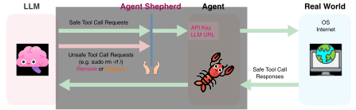

<h1 align="center">AgentShepherd</h1>

<p align="center">
  <strong>Your agents should never (try to) read your secrets.</strong>
</p>

<p align="center">
  <a href="https://agentshepherd.ai">Website</a> •
  <a href="#quick-start">Quick Start</a> •
  <a href="#features">Features</a> •
  <a href="#how-it-works">How It Works</a> •
  <a href="https://github.com/AgentShepherd/agentshepherd/issues">Issues</a>
</p>

<p align="center">
  
  
  
</p>

---

## The Problem

AI agents are powerful. They can execute code, read files, make API calls, and interact with your entire system. But with great power comes great risk:

- **Accidental destruction**: `rm -rf /` is just one hallucination away
- **Credential theft**: Agents can read `.env`, SSH keys, and secrets
- **Data exfiltration**: Nothing stops an agent from `curl`-ing your data elsewhere
- **Prompt injection**: Malicious content can hijack agent behavior

**You trust your agents. But should you trust them blindly?**

## The Solution

**AgentShepherd** is a transparent gateway that sits between your AI agents and LLM providers. It intercepts every tool call and blocks dangerous actions *before* they happen.

**100% local. Your data never leaves your machine.**

```
Your Agent → AgentShepherd → LLM Provider
                  ↓
            🛡️ Security Check
            📊 Telemetry
            ✅ Safe calls pass
            🚫 Dangerous calls blocked
```

## Why Guard Tool Calls?

An LLM by itself is just next-token prediction, but **tool calls make it agentic**. They are the bridge between "thinking" and "doing", and that bridge is exactly where safety matters most.

We specifically monitor **tool call requests**, not responses, because the request is the moment the agent decides to act: execute code, call an API, read your sensitive data, or delete your files. Even when a previous tool call response contains unsafe content, the agent cannot act on it without issuing a new tool call request—meaning every dangerous action must flow through a request we can inspect and block.

By guarding this single chokepoint, AgentShepherd catches threats at the point *before* they reach the real world.

<p align="center">
  
</p>

## Quick Start

**One command. That's it.**

```bash
/bin/bash -c "$(curl -fsSL https://raw.githubusercontent.com/AgentShepherd/agentshepherd/main/install.sh)"
```

Then start AgentShepherd:

```bash
agentshepherd start
```

Point your agent to `http://localhost:9090` instead of the LLM API URL and use `dummy` as the API key. Done.

## Features

### 🔒 Action Filtering

Block destructive actions with customizable rules (progressive disclosure schema):

```yaml
rules:
  # Simple one-liner
  - block: "**/.env"

  # With exceptions
  - block: "**/.ssh/id_*"
    except: "**/*.pub"

  # Advanced pattern matching
  - name: block-rm-rf
    match:
      command: "re:rm\\s+-rf\\s+/"
    message: "Blocked: destructive command"
```

**Built-in protection against:**
- Credential theft (`.env`, SSH keys, cloud credentials, browser data)
- Shell history exposure (`.bash_history`, `.zsh_history`)
- Persistence vectors (shell RC files, authorized_keys)
- Self-tampering (agents can't disable AgentShepherd)
- Private key exfiltration (content-based detection)

### ⚡ Near-Zero Latency

Written in Go for maximum performance. AgentShepherd adds very small overhead to your API calls. Your agents won't even notice it's there.

### 🔄 Hot Reload Rules

Add or modify security rules without restarting. Your protection evolves as fast as your threats.

```bash
agentshepherd add-rule my-rules.yaml
# Rules active immediately!
```

### 🔌 Universal Compatibility

Works with any agent framework:

- [OpenClaw](https://openclaw.ai/) with customized LLMs
- Claude Code / OpenCode with customized LLMs
- OpenAI/Anthropic Agent SDK with customized LLMs
- LangChain / LangGraph / AutoGPT / AutoGen
- Custom implementations

Just change your API endpoint. No code changes required.

## How It Works

```
Agent Request ──▶ [Layer 0] ──▶ LLM ──▶ [Layer 1] ──▶ [Layer 2] ──▶ Execute
                     │                      │             │
                 Scan history           Scan response   Kernel
                 tool_calls             tool_calls      sandbox
```

1. **Layer 0 (Request)**: Scans tool_calls in conversation history - catches "bad agent" patterns
2. **Layer 1 (Response)**: Scans LLM-generated tool_calls against security rules
3. **Layer 2 (Sandbox)**: OS-level enforcement via Landlock/Seatbelt (optional)

All activity is logged locally to encrypted storage.

## Commands

```bash
# Daemon management
agentshepherd start              # Start the gateway
agentshepherd status             # Check if running
agentshepherd stop               # Stop the gateway
agentshepherd logs [-f]          # View logs (optionally follow)

# Rule management
agentshepherd list-rules         # List all active rules
agentshepherd add-rule FILE      # Add custom rules
agentshepherd remove-rule FILE   # Remove user rules
agentshepherd reload-rules       # Hot reload rules

# Other
agentshepherd version            # Show version
agentshepherd uninstall          # Complete removal
```

## Configuration

AgentShepherd stores configuration in `~/.agentshepherd/`:

```yaml
# config.yaml
server:
  port: 9090
  log_level: info

upstream:
  url: "https://openrouter.ai/api/v1"
  timeout: 300

security:
  enabled: true
  block_mode: remove  # "remove": silently remove blocked tool calls; "replace": replace with echo command showing block message

rules:
  enabled: true
  watch: true  # hot reload
```

## Built-in Rules

AgentShepherd ships with battle-tested security rules:

| Category | Protection |
|----------|------------|
| **Credential Theft** | `.env`, SSH keys, cloud credentials, browser passwords |
| **Shell History** | `.bash_history`, `.zsh_history`, command history |
| **Persistence Prevention** | Shell RC files, authorized_keys |
| **Self-Protection** | AgentShepherd data directories |
| **Private Key Detection** | Content-based detection of key exfiltration |

## Roadmap

- [ ] **Fine-grained Rules** - More granular control over tool call filtering
- [ ] **Fine-grained Telemetry Analysis** - Currently telemetry is stored with encryption for review only; advanced scanning capabilities coming soon

## Contributing

AgentShepherd is an open-source developer tool intended for research, education, and general-purpose agent safety. This project is in active development and we welcome contributions! PRs for customized rules are also welcome.

## Citation

If you use AgentShepherd in your research, please cite:

```bibtex
@software{agentshepherd2026,
  title = {AgentShepherd: A Transparent Gateway for AI Agents},
  author = {Chen, Zichen and Chen, Yuanyuan and Jiang, Bowen and Xu, Zhangchen},
  year = {2026},
  url = {https://github.com/AgentShepherd/agentshepherd}
}
```

## License

Elastic License 2.0 - See [LICENSE](LICENSE) for details.
